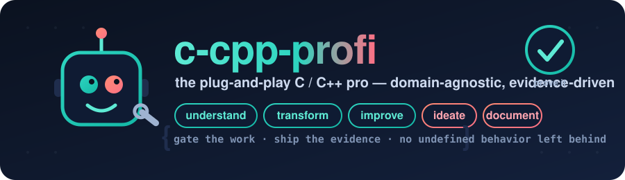

<p align="center">
  
</p>

<p align="center">
  <a href="https://github.com/MuhDur/c-cpp-profi/actions/workflows/skill-validate.yml"></a>
  
  
  
</p>

<p align="center"><b>Point an agent at any C or C++ repository and have it work like a senior engineer: read the code at every level, change it safely, harden it, and hand back machine-checkable proof.</b></p>

`c-cpp-profi` is an agent skill for serious C and C++ work. It turns "the model knows C++" into a disciplined engineering loop with deterministic gates, so an agent understands a codebase, transforms it, improves it, proposes ideas, and documents it, then proves every claim with the exact command that produced the result.

```bash
git clone git@github.com:MuhDur/c-cpp-profi.git && cd c-cpp-profi
mkdir -p "$HOME/.codex/skills" && ln -s "$PWD/skill/c-cpp-profi" "$HOME/.codex/skills/c-cpp-profi"
```

GitHub: <https://github.com/MuhDur/c-cpp-profi>

## Try it in 60 seconds

Point the read-only comprehension map at any C/C++ checkout; it answers "what is this, and how does it run" without building anything:

```bash
$ bash "$HOME/.codex/skills/c-cpp-profi/scripts/cpp_comprehension_map.sh" /path/to/cJSON
language breakdown: .c=37 | count
exported-symbol hint (visibility/EXPORT/API macro) | cJSON.h:66
## L3 touched-path callgraph
cJSON_Parse -> cJSON_ParseWithOpts          | cJSON.c:1227
cJSON_Delete -> cJSON_Delete (recursive)    | cJSON.c:253
```

Then plan the gates, fill the report, and let the checker accept or reject it:

```bash
S="$HOME/.codex/skills/c-cpp-profi/scripts"
bash    $S/cpp_gate_report.sh . > gate-report.md
python3 $S/cpp_evidence_check.py gate-report.md --derive-profiles   # exits non-zero until the proof matches the work
```

---

## The problem

C and C++ give an agent enough control to do excellent systems work and enough rope to ship undefined behavior, silent ABI breaks, performance "wins" that never measured anything, and ports that only ever ran on one machine. Left alone, an agent declares victory at "it compiles."

## The solution

The skill makes the missing engineering loop mandatory and falsifiable:

```text
inventory -> invariants -> gate plan -> implementation -> mechanical evidence -> residual-risk handoff
```

Every claim lands as a gate with a status of `passed`, `failed`, `not run`, or `not applicable`, an exact command, and the evidence it produced. A Python checker reads the report and rejects it if the proof for the work actually done is missing.

| What agents usually do | What this skill requires |
|---|---|
| Treat "it compiles" as done | Warning-clean compile, tests, static-analysis triage, sanitizers, fuzzing, ABI, perf, and portability gates when they apply |
| Optimize from intuition | Baseline, profile, opportunity score, one lever, behavior oracle, then remeasure on the same workload |
| Trust a static analyzer's exit code | Read the analyzer output and triage every finding |
| Leave ABI to chance | Symbol, layout, public-header, calling-convention, exception, and allocator review |
| Assume a parser is fine | Sanitizer-backed fuzz or corpus evidence for untrusted bytes |
| Claim native UI "looks right" | Captured artifacts and pixel/golden comparison |
| Port by "it builds on arm64" | A differential oracle that runs the same corpus on the target and diffs the output |

## What an agent can do with it

The skill is built around six capabilities, each backed by a reference and a deterministic script:

1. **Understand** any repo at every level: a four-layer comprehension ladder (build graph, exported API, touched-path callgraph, domain intent) emitted by `cpp_comprehension_map.sh`, with self-recursion marked and C++ method dispatch resolved.
2. **Transform** it: port, modernize, or re-architect, each behind its own oracle. The port mode runs a true cross-architecture differential (see Evidence).
3. **Improve** it: a gate ladder plus nine copy-ready remediation recipes, a binary-size method, and an aliasing/cast-width lane that has caught a real type-punning over-read.
4. **Generate ideas**: an innovation engine with a backlog script and an idea-card checker that enforces a mix of accretive and radical bets.
5. **Document** it: a documentation reference and a docs linter, with the "the example must compile and run" rule.
6. **Stay domain-agnostic**: a universal core plus fourteen plug-in domain packs and an unknown-domain derivation procedure, selected automatically by `cpp_domain_detect.sh`.

## Evidence

The skill is validated by running it on 50 maximally different fresh C/C++ repositories, then folding every observed weakness back into the tools.

- **50 of 50 repositories carded**, spanning JSON/XML/INI/HTTP/SIMD parsers, crypto (mbedtls, libsodium, BLAKE2), interpreters and compilers (lua, chibicc, tinycc, wren, duktape, quickjs), databases (leveldb, sqlite, redis), async I/O and servers (libuv, nginx, libzmq, nng), an RTOS (FreeRTOS, Zephyr), an embedded filesystem (littlefs), SIMD math (cglm, xsimd, highway), audio (miniaudio), regex (re2, pcre2), compression and codecs (zlib, lz4, libjpeg-turbo, libpng), a test framework (Catch2), and real flight software (NASA cFE and F´).
- **It plugs into a domain it was never told about.** With no special briefing, the domain detector classified NASA cFE, the core Flight Executive, as the space/satellite pack from 14,398 matching signals and selected the matching gate set.
- **It finds real defects, across codebases and domains.** On a fresh cJSON, the fuzz-plus-ASan gate caught a seeded one-character bounds bug with a 5-byte reproducer while the clean tree survived 1.27M executions. The same was reproduced on jsmn with a deterministic ASan harness, and on lz4: removing one term of the safe decoder's output guard turned a correctly-rejected undersized decode into an ASan buffer overflow localized to the exact protected `LZ4_memmove`, while the clean and restored trees both rejected cleanly.
- **It ports across architectures and proves it.** The identical cJSON driver, cross-compiled for aarch64 and riscv64 and run under QEMU over a 638-input corpus, produced byte-identical output to the x86-64 baseline (one shared SHA-256). A `char`-signedness control diverges on the same run, so the match is a real result rather than a rubber stamp.
- **It works in fresh hands.** Five independent agents were each handed only the skill and one library they had never seen, with no hints. Three found real, reproducible bugs (a misaligned-load UB in cgltf reached through its public accessor API on a file the loader accepts as valid; unbounded-recursion stack overflows in tinyexpr and tomlc99), each re-verified from a saved input; the other two reported their targets clean after millions of sanitized executions rather than inventing a finding.
- **Findings feed back.** Running the gates on real repos surfaced about 100 weakness observations that were folded into the scripts and re-verified on the same repos; for example, comment and string-literal false positives dropped from 233 to 1 on cglm, and domain detection was corrected for crypto, database, audio, and parser repos.

## Install

Clone the repo and link the skill into your local skill root:

```bash
git clone git@github.com:MuhDur/c-cpp-profi.git
cd c-cpp-profi
mkdir -p "$HOME/.codex/skills"
ln -s "$PWD/skill/c-cpp-profi" "$HOME/.codex/skills/c-cpp-profi"
python3 skill/c-cpp-profi/scripts/validate_skill_contract.py skill/c-cpp-profi
```

For shared-agent sessions, link the same skill into the shared root:

```bash
mkdir -p "$HOME/.agents/skills"
ln -s "$PWD/skill/c-cpp-profi" "$HOME/.agents/skills/c-cpp-profi"
```

If a destination already exists, inspect it and decide whether to keep it, move it aside, or point agents at this checkout. The commands above fail rather than overwrite.

## Use it on a repo

From a target repository, understand it first (every step is read-only), then plan and prove:

```bash
S="$HOME/.codex/skills/c-cpp-profi/scripts"   # or an absolute path to this checkout's scripts/
bash    $S/cpp_inventory.sh .          # build system, standards, source counts, public API
bash    $S/cpp_domain_detect.sh .      # which domain pack(s) apply: parser, crypto, embedded, space, ...
bash    $S/cpp_comprehension_map.sh .  # build graph + entry points + exported API + touched-path callgraph
bash    $S/cpp_risk_scan.sh .          # triage unsafe APIs and UB hazards (comment and string aware)
bash    $S/cpp_backlog.sh .            # evidence-anchored improvement backlog
bash    $S/cpp_gate_plan.sh .
bash    $S/cpp_gate_report.sh . > gate-report.md
python3 $S/cpp_evidence_check.py gate-report.md --derive-profiles   # profiles derived from the report itself
```

Add strict profiles for risk-specific work:

```bash
# Parser or untrusted input
python3 $S/cpp_evidence_check.py gate-report.md --profile parser --require-warning-clean --require-analyzer-review

# Public library or ABI surface
python3 $S/cpp_evidence_check.py gate-report.md --profile public-abi

# Optimization claim
python3 $S/cpp_evidence_check.py gate-report.md --profile performance --require-performance-proof

# Cross-architecture port
python3 $S/cpp_evidence_check.py gate-report.md --profile port --require-transform-proof
```

## The optimization loop

Every performance claim keeps the full loop visible:

```text
baseline -> profile -> opportunity score -> oracle -> one lever -> verify -> report
```

The strict performance proof requires baseline timing, a profile or hotspot, an opportunity score, a behavior oracle (or golden output, or isomorphism proof), and after data. Native-code concerns stay in scope: UB, floating-point semantics, ABI, allocator ownership, SIMD fallback, target dispatch, portability, p99, and worst-case latency.

## Architecture

```text
agent request
    |
    v
SKILL.md  (router)
    |
    +--> references/*.md      deep C/C++ domain rules
    +--> scripts/*.sh,*.py    deterministic gates and report checks
    +--> examples/*.md        compact execution cards
    +--> assets/              reusable sanitizer, fuzz, and CI scaffolds
    |
    v
gate report  ->  evidence checker
    |
    v
handoff with passed / failed / not-run / not-applicable gates and residual risk
```

| Path | Purpose |
|---|---|
| `skill/c-cpp-profi/SKILL.md` | Skill entrypoint and routing. |
| `skill/c-cpp-profi/references/` | 20 deep references: expert canon, toolchain matrix, quality gates, memory safety, concurrency, performance, security, fuzzing, ABI and portability, native-UI goldens, refactor isomorphism, code transform, domain-agnostic mastery and unknown-domain derivation, the innovation engine, repo comprehension, remediation recipes, and documentation authoring. |
| `skill/c-cpp-profi/scripts/` | Read-only helpers: inventory, gate plan, risk scan, gate report, evidence checker (16 risk profiles, scope-derived), domain detector, comprehension map, accretive backlog, idea-card checker, docs linter, ABI snapshot, pixel diff, and the contract validator. |
| `skill/c-cpp-profi/assets/` | Reusable CMake, Meson, and libFuzzer scaffolds, plus a portable `ci/` drop-in (GitHub Actions workflow and pre-commit hook) a consumer repo copies to get the gates in CI. |

## Comparison

| Alternative | Strength | Gap this skill covers |
|---|---|---|
| General C/C++ model knowledge | Flexible reasoning | No enforced gate packet or machine-checkable handoff |
| Linters and static analyzers alone | Good defect discovery | They do not prove tests, sanitizer coverage, ABI, fuzz, performance, or residual risk |
| Generic optimization skills | Profile-first methodology | Native-code semantics (UB, allocator ownership, ABI, SIMD fallback, portability) need C/C++-specific proof |
| Project CI alone | Project-specific regression signal | CI often misses local tool availability, analyzer triage, fuzz campaigns, ABI drift, and performance methodology |

## Validation

Run the full local validation set:

```bash
python3 workspace/completion_audit.py
python3 workspace/completion_audit.py --portable
python3 skill/c-cpp-profi/scripts/validate_skill_contract.py skill/c-cpp-profi
bash -n skill/c-cpp-profi/scripts/*.sh
python3 -m py_compile skill/c-cpp-profi/scripts/*.py workspace/completion_audit.py
```

The GitHub workflow runs the portable checks and the evidence-checker fixtures on push and pull request.

## Troubleshooting

| Symptom | Fix |
|---|---|
| `cpp_evidence_check.py` rejects a report | Fill every scope and residual-risk field, then mark each gate `passed`, `failed`, `not run`, or `not applicable` with an exact command and evidence. |
| Static analysis exits `0` but prints findings | Do not mark the gate clean until the findings are reviewed, triaged, fixed, or explicitly deferred. |
| `ctest` fails before printing a version | The `ctest` on `PATH` may be a broken wrapper; use the CTest binary from the same CMake install and record the substitution. |
| `abi-dumper -public-headers` emits odd `ctags` warnings | Pass a directory of public headers or a file of header paths, and verify Universal Ctags is installed. |
| A performance result looks faster once | Re-run with warmups, repetitions, identical inputs, the same build mode and CPU policy, and a profile showing the hotspot moved. |

## FAQ

**Does it run my code automatically?** No. The understanding scripts are read-only. Building, sanitizing, and fuzzing happen only when you run the gate commands.

**What languages and standards?** C and C++ across the common standards, plus a C-to-Rust port path behind a frozen ABI seam.

**Does it need network or root?** The core loop needs neither. A cross-architecture port needs a cross toolchain and an emulator (for example `gcc-aarch64-linux-gnu` and `qemu-user-static`); without them, use the same-architecture compiler and optimization-level oracle.

**Does it replace project CI or maintainers?** No. It produces the evidence packet a reviewer wants; it does not stand in for project CI, maintainers, or domain-specific safety certification.

## Contributions

*About Contributions:* Please don't take this the wrong way, but I do not accept outside contributions for any of my projects. I simply don't have the mental bandwidth to review anything, and it's my name on the thing, so I'm responsible for any problems it causes; thus, the risk-reward is highly asymmetric from my perspective. I'd also have to worry about other "stakeholders," which seems unwise for tools I mostly make for myself for free. Feel free to submit issues, and even PRs if you want to illustrate a proposed fix, but know I won't merge them directly. Instead, I'll have Claude or Codex review submissions via `gh` and independently decide whether and how to address them. Bug reports in particular are welcome. Sorry if this offends, but I want to avoid wasted time and hurt feelings. I understand this isn't in sync with the prevailing open-source ethos that seeks community contributions, but it's the only way I can move at this velocity and keep my sanity.
